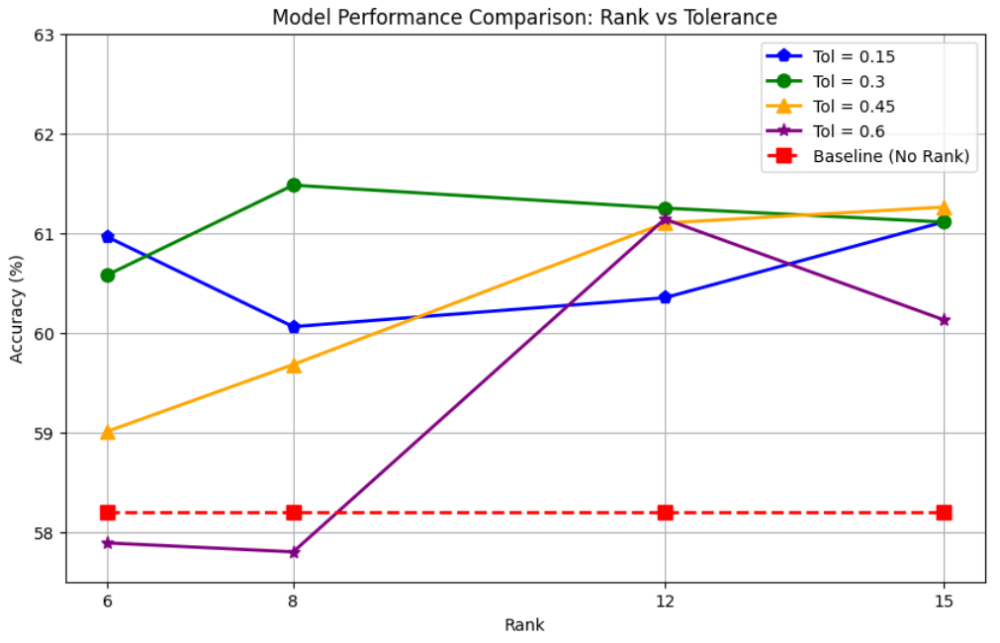
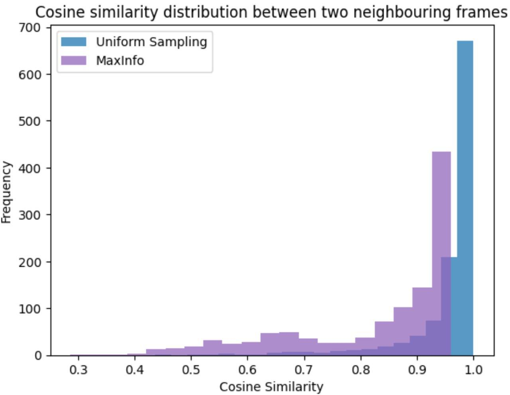
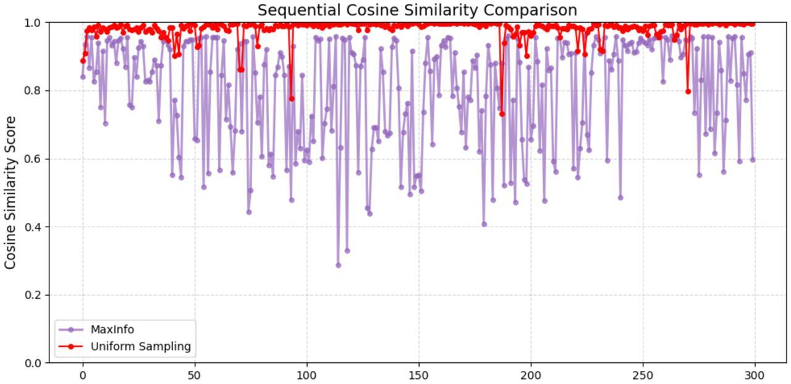

Figure 1. CLIP scores between questions and video frame information.

Figure 2. Impact of the hyperparameters Rank and volume on model performance.

Figure 3. Visualisation of the distribution of similarity between frames using uniform sampling and MaxInfo sampling.

Figure 4. Visualisation of the similarity between frames using the uniform sampling approach and the MaxInfo sampling approach.

Figure 5. Qualitative example: In part (a) shows the difference in sampling between Uniform Sampling and MaxInfo, and visualise the information we sampled, which we were able to select to Ground True or with a high degree of similarity frames. In part (b) shows the "CLIP score between options and frame information" in our MaxInfo sample, showing that MaxInfo's approach is to cover all answers in one sample.
